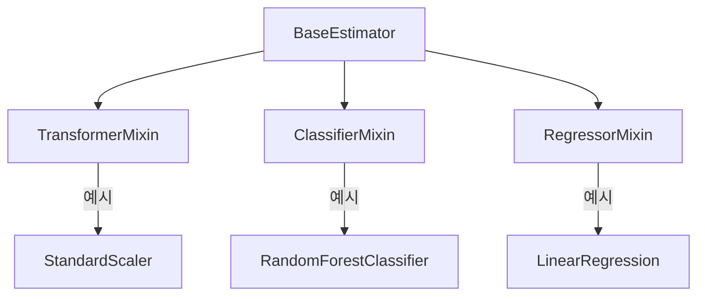
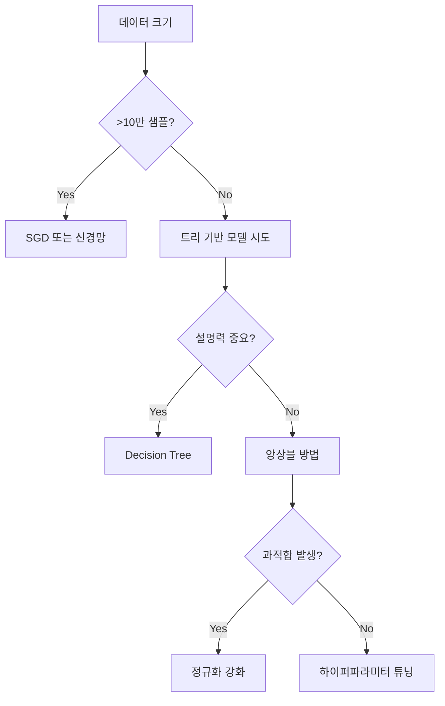

## Ⅰ. 머신러닝 알고리즘 4대 패러다임

### 1. 정보 기반 모델 (Tree-based)
| 알고리즘      | 특징                                                                 | 활용 사례                   |
|---------------|---------------------------------------------------------------------|----------------------------|
| Decision Tree | 단일 트리 구조, 정보이득/지니계수 기반 분할                        | 규칙 기반 분류 시스템       |
| Random Forest | 배깅 기반 앙상블, 다수결 투표                                      | 금융 사기 탐지             |
| AdaBoost      | 오차 기반 순차 학습, 가중치 조정                                   | 이미지 분류                 |
| Gradient Boost| 잔차 최소화 목적, 누적 학습                                        | 검색 엔진 순위 최적화       |
| XGBoost       | 병렬 처리 최적화, 정규화 항 추가                                   | 대회용 고성능 모델         |

**의사결정트리 분할 시각화:**
```python
from sklearn.tree import plot_tree
plt.figure(figsize=(15,10))
plot_tree(clf, filled=True, feature_names=iris.feature_names)
plt.show()
```

---

### 2. 확률 기반 모델 (베이지안)
**Naive Bayes 작동 원리:**
```
P(스팸|단어) ∝ P(단어|스팸) * P(스팸)
```
- **장점**: 계산 효율성 높음 (특징 독립 가정)
- **단점**: 특징 간 상관관계 무시
- **적합 사례**: 텍스트 분류, 스팸 필터링

**TF-IDF + Naive Bayes 예제:**
```python
from sklearn.feature_extraction.text import TfidfVectorizer
from sklearn.naive_bayes import MultinomialNB

tfidf = TfidfVectorizer()
X_train = tfidf.fit_transform(text_data)
clf = MultinomialNB().fit(X_train, labels)
```

---

### 3. 유사도 기반 모델
**거리 계산 비교표:**

| 거리 지표       | 공식                          | 특징                      |
|-----------------|-------------------------------|---------------------------|
| 유클리디언      | √Σ(x_i - y_i)²               | 직선 거리                 |
| 맨해튼          | Σ\|x_i - y_i\|               | 격자 이동 거리            |
| 코사인          | (A·B)/(\|A\|\|B\|)          | 방향 유사도               |
| 마할라노비스    | √((x-μ)Σ⁻¹(x-μ))            | 분산 고려                 |

**K-means 클러스터링 시각화:**
```python
from sklearn.cluster import KMeans
import matplotlib.pyplot as plt

kmeans = KMeans(n_clusters=3).fit(X)
plt.scatter(X[:,0], X[:,1], c=kmeans.labels_)
plt.plot(kmeans.cluster_centers_, 'rx', markersize=15)
```

---

### 4. 오차 기반 모델 (신경망)
**손실 함수 비교:**
```python
# MSE (연속값 예측)
loss = tf.keras.losses.MeanSquaredError()

# Cross Entropy (분류 문제)
loss = tf.keras.losses.CategoricalCrossentropy()
```

**간단한 신경망 예제:**
```python
model = tf.keras.Sequential([
    tf.keras.layers.Dense(64, activation='relu'),
    tf.keras.layers.Dropout(0.2),
    tf.keras.layers.Dense(10, activation='softmax')
])
model.compile(optimizer='adam', loss='sparse_categorical_crossentropy')
```

---

## Ⅱ. Scikit-learn 핵심 기능

### 1. Estimator 체계


### 2. 파이프라인 설계 패턴
**전형적인 워크플로우:**
```python
from sklearn.pipeline import make_pipeline
from sklearn.preprocessing import PolynomialFeatures
from sklearn.linear_model import Ridge

pipe = make_pipeline(
    StandardScaler(),
    PolynomialFeatures(degree=2),
    Ridge(alpha=0.5)
)
pipe.fit(X_train, y_train)
```

---

## Ⅲ. 고급 모델 튜닝 기법

### 1. 검증 전략 비교
| 방법              | 장점                          | 단점                    |
|-------------------|-------------------------------|-------------------------|
| Hold-out          | 계산 효율적                   | 데이터 활용도 낮음      |
| K-Fold CV         | 신뢰성 높은 평가              | 계산 비용 증가          |
| Stratified K-Fold | 클래스 분포 유지              | 회귀 문제에 부적합      |
| TimeSeriesSplit   | 시계열 특성 반영              | 일반 데이터에 부적합    |

### 2. 하이퍼파라미터 최적화 기법
**Grid Search vs Bayesian Optimization:**
```python
# Grid Search 예제
from sklearn.model_selection import GridSearchCV
params = {'C': [0.1, 1, 10], 'gamma': [0.01, 0.1]}
grid = GridSearchCV(SVC(), params).fit(X, y)

# Optuna 예제
import optuna
def objective(trial):
    C = trial.suggest_loguniform('C', 1e-5, 1e5)
    model = SVC(C=C).fit(X_train, y_train)
    return accuracy_score(y_val, model.predict(X_val))

study = optuna.create_study(direction='maximize')
study.optimize(objective, n_trials=100)
```

---

## Ⅳ. 정규화 기법 심층 분석

### L1 vs L2 정규화 비교
```python
import matplotlib.pyplot as plt
import numpy as np

# 가중치 분포 시뮬레이션
np.random.seed(42)
weights = np.random.randn(100)

# L1 정규화 적용
l1_weights = np.sign(weights) * np.maximum(np.abs(weights) - 0.5, 0)

# L2 정규화 적용
l2_weights = weights * (1 / (1 + 0.5))

plt.figure(figsize=(10,6))
plt.hist(weights, alpha=0.5, label='Original')
plt.hist(l1_weights, alpha=0.5, label='L1')
plt.hist(l2_weights, alpha=0.5, label='L2')
plt.legend(); plt.show()
```

---

## Ⅴ. 실전 적용 사례

### 주택 가격 예측 파이프라인
```python
from sklearn.compose import ColumnTransformer
from sklearn.ensemble import GradientBoostingRegressor

preprocessor = ColumnTransformer([
    ('num', StandardScaler(), ['sqft', 'bedrooms']),
    ('cat', OneHotEncoder(), ['neighborhood'])
])

model = make_pipeline(
    preprocessor,
    GradientBoostingRegressor(n_estimators=200, learning_rate=0.05)
)

param_grid = {
    'gradientboostingregressor__max_depth': [3,5],
    'gradientboostingregressor__subsample': [0.8, 1.0]
}

grid = GridSearchCV(model, param_grid, cv=5)
grid.fit(X, y)
```

---

## 결론: 알고리즘 선택 가이드
